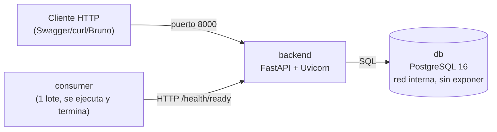

# Servicio de Gestión de Solicitudes Institucionales

Prueba Técnica Backend Developer — Semi Senior. API REST para registrar,
consultar y hacer seguimiento del estado de solicitudes institucionales,
contenerizada junto a PostgreSQL y un servicio consumidor que simula un
sistema externo integrándose con ella.

```bash
docker compose up --build
```

## Índice

- [Arquitectura](#arquitectura)
- [Tecnologías](#tecnologías)
- [Ejecutar, detener y probar](#ejecutar-detener-y-probar)
- [Variables de entorno](#variables-de-entorno)
- [Endpoints](#endpoints)
- [Ejemplos de consumo](#ejemplos-de-consumo)
- [Decisiones técnicas](#decisiones-técnicas-resumen)
- [Limitaciones conocidas](#limitaciones-conocidas)
- [Posibles mejoras](#posibles-mejoras)
- [Matriz de cumplimiento](#matriz-de-cumplimiento)
- [Propuesta de despliegue en AWS](#propuesta-de-despliegue-en-aws)
- [Licencia](#licencia)

## Arquitectura

Tres servicios en contenedores independientes, orquestados con Docker Compose:



El backend está organizado en capas (`api/routers` → `services` →
`repositories` → `models`), con manejo centralizado de excepciones y logging
estructurado JSON con identificador de correlación propagado entre el
consumidor y la API. El detalle completo —diagramas C4, modelo de datos,
máquina de estados y secuencias de concurrencia/reintentos— está en
[`docs/ARQUITECTURA.md`](docs/ARQUITECTURA.md).

## Tecnologías

| Componente | Stack |
|---|---|
| Backend | Python 3.12, FastAPI, Pydantic v2, SQLAlchemy 2.0 (síncrono), Alembic, `psycopg` v3, `structlog` |
| Base de datos | PostgreSQL 16 |
| Consumidor | Python 3.12, `httpx`, `structlog` |
| Pruebas | `pytest`, `pytest-cov`, `httpx.MockTransport` |
| Infraestructura | Docker multi-stage builds, Docker Compose (perfiles) |

## Ejecutar, detener y probar

```bash
# 1. Configurar variables de entorno
cp .env.example .env

# 2. Levantar la solución completa (db + backend + consumer)
docker compose up --build

# 3. Ver logs en vivo
docker compose logs -f

# 4. Detener (conserva los datos en el volumen)
docker compose down

# 5. Detener y borrar también los datos (arranque en frío)
docker compose down -v
```

Al terminar el arranque: `db` y `backend` quedan `healthy` de forma
persistente; `consumer` procesa un lote de solicitudes de demostración
(incluye un identificador duplicado a propósito, para mostrar el manejo de
conflicto) y termina con código de salida `0` — ver
[`docs/adr/0014`](docs/adr/0014-consumidor-un-solo-lote.md) para la
justificación de por qué es un proceso de un solo lote y no un bucle continuo.

```bash
# Volver a ejecutar el lote del consumidor manualmente, cuantas veces se quiera
docker compose run --rm consumer

# Documentación interactiva de la API
open http://localhost:8000/docs
```

### Pruebas automatizadas

Las pruebas corren en un *stage* de Docker separado de producción (nunca se
despliegan, ver [`docs/adr/0012`](docs/adr/0012-stage-de-pruebas-en-dockerfile.md))
y **no** se levantan con `docker compose up` (perfil `test` dedicado):

```bash
# Backend: 49 pruebas contra PostgreSQL real (no SQLite, ver ADR-0011),
# incluida la verificación de concurrencia con 20 hilos simultáneos.
docker compose --profile test run --rm backend-tests

# Consumidor: 16 pruebas de la política de reintentos con httpx.MockTransport
# (backoff, distinción transitorio/definitivo, Retry-After, correlation-id).
docker compose --profile test run --rm consumer-tests
```

Resultado esperado: `49 passed` (97% cobertura) y `16 passed`.

## Variables de entorno

Ver [`.env.example`](.env.example) para la plantilla completa y comentada.

| Variable | Servicio | Default | Descripción |
|---|---|---|---|
| `APP_NAME` | backend | `solicitudes-api` | Nombre reportado en logs y en el título de OpenAPI |
| `APP_ENV` | backend | `development` | Entorno de ejecución |
| `LOG_LEVEL` | ambos | `INFO` | Nivel de log |
| `POSTGRES_USER` / `POSTGRES_PASSWORD` / `POSTGRES_DB` | db | — | Credenciales de PostgreSQL (nunca en el código, ver `.gitignore`) |
| `POSTGRES_HOST` / `POSTGRES_PORT` | db | `db` / `5432` | `db` es el nombre del servicio, resuelto por el DNS interno de Compose |
| `DATABASE_URL` | backend | — | Cadena de conexión completa (`postgresql+psycopg://...`) |
| `API_BASE_URL` | consumer | `http://backend:8000` | URL base de la API a consumir |
| `CONSUMER_NUM_REQUESTS` | consumer | `10` | Tamaño del lote de solicitudes por ejecución |
| `CONSUMER_TIMEOUT_CONNECT_S` / `CONSUMER_TIMEOUT_READ_S` | consumer | `3` / `10` | Timeouts por fase de la conexión HTTP |
| `CONSUMER_MAX_RETRIES` | consumer | `3` | Reintentos además del intento inicial (4 intentos totales) |
| `CONSUMER_BACKOFF_BASE_S` | consumer | `0.5` | Base del backoff exponencial con jitter |

## Endpoints

| Método | Ruta | Descripción | Éxito | Errores |
|---|---|---|---|---|
| `POST` | `/solicitudes` | Crear una solicitud | `201` | `422` datos inválidos · `409` duplicado |
| `GET` | `/solicitudes` | Listar con filtros (`estado`, `tipo`, `prioridad`, `identificador_externo`) y paginación (`limit`, `offset`) | `200` | `422` límite fuera de rango |
| `GET` | `/solicitudes/{id}` | Consultar una solicitud por su UUID interno | `200` | `404` no existe · `422` UUID mal formado |
| `PATCH` | `/solicitudes/{id}/estado` | Cambiar el estado (máquina de estados, idempotente) | `200` | `404` no existe · `409` transición inválida |
| `GET` | `/health` | Liveness — no depende de PostgreSQL | `200` | — |
| `GET` | `/health/ready` | Readiness — verifica conexión a PostgreSQL | `200` | `503` BD no disponible |

Documentación interactiva completa (OpenAPI/Swagger) en `/docs` y `/redoc` con
el backend corriendo. Todos los errores comparten un mismo contrato (ver
sección de decisiones técnicas).

## Ejemplos de consumo

Se eligió **[Bruno](https://www.usebruno.com/)** sobre Postman: sus
colecciones son archivos de texto plano (`.bru`), versionables en Git sin
necesidad de exportar/importar JSON. La colección está en
[`docs/ejemplos/bruno/`](docs/ejemplos/bruno/) — abrirla directamente con la
aplicación Bruno apuntando a esa carpeta.

Para quien prefiera no instalar nada, los mismos escenarios con `curl`:

```bash
# Crear una solicitud válida
curl -X POST http://localhost:8000/solicitudes \
  -H "Content-Type: application/json" \
  -d '{
    "identificador_externo": "SOL-2026-000123",
    "tipo": "soporte_tecnico",
    "nombre_solicitante": "Ana María Restrepo",
    "correo": "ana.restrepo@institucion.edu.co",
    "descripcion": "No puedo acceder al portal académico desde el lunes.",
    "prioridad": "alta"
  }'

# Repetir la misma petición: 409 (duplicado, manejo atómico de concurrencia)
curl -i -X POST http://localhost:8000/solicitudes \
  -H "Content-Type: application/json" \
  -d '{"identificador_externo":"SOL-2026-000123", "tipo":"academica", "nombre_solicitante":"Otro", "correo":"otro@inst.edu.co", "descripcion":"x", "prioridad":"baja"}'

# Listar filtrando por estado y prioridad
curl "http://localhost:8000/solicitudes?estado=recibida&prioridad=alta"

# Cambiar el estado (transición válida)
curl -X PATCH http://localhost:8000/solicitudes/<id>/estado \
  -H "Content-Type: application/json" -d '{"estado":"en_proceso"}'

# Transición inválida: 409 con los estados a los que sí se puede pasar
curl -i -X PATCH http://localhost:8000/solicitudes/<id>/estado \
  -H "Content-Type: application/json" -d '{"estado":"completada"}'
```

Un ejemplo completo de una ejecución real (arranque, migraciones, backend,
consumidor con su duplicado deliberado y los escenarios de arriba) está
capturado en [`docs/logs-ejecucion-ejemplo.log`](docs/logs-ejecucion-ejemplo.log).

## Decisiones técnicas (resumen)

Registradas como [Architecture Decision Records](docs/adr/README.md), una por
archivo, con alternativas descartadas y consecuencias. Las más relevantes:

| ADR | Decisión |
|---|---|
| [0002](docs/adr/0002-uuid-como-identificador-interno.md) | UUID interno distinto del identificador externo del sistema de origen |
| [0003](docs/adr/0003-concurrencia-restriccion-unica-on-conflict.md) | Concurrencia resuelta con `UNIQUE` + `INSERT ... ON CONFLICT ... RETURNING` (atómico, sin condición de carrera) |
| [0004](docs/adr/0004-alembic-para-migraciones.md) | Alembic para migraciones versionadas, no un script SQL de inicialización |
| [0007](docs/adr/0007-sqlalchemy-sincrono-sobre-asincrono.md) | SQLAlchemy síncrono: FastAPI ejecuta los handlers `def` en threadpool, no bloquea el *event loop* |
| [0008](docs/adr/0008-contrato-uniforme-de-errores.md) | Contrato de error único para toda la API; el 500 nunca expone detalle técnico, solo un `correlation_id` |
| [0009](docs/adr/0009-observabilidad-logs-json-correlacion.md) | Logs JSON con `correlation_id` propagado entre consumidor y backend vía `contextvars` |
| [0010](docs/adr/0010-liveness-readiness-separados.md) | `/health` (liveness) nunca consulta la BD; `/health/ready` sí — evita reinicios en bucle ante una caída de BD |
| [0011](docs/adr/0011-estrategia-de-pruebas-postgres-real.md) | Pruebas contra PostgreSQL real, no SQLite: la concurrencia y los `CHECK` dependen del motor |
| [0013](docs/adr/0013-politica-de-reintentos-consumidor.md) | Reintentos por transitorio/definitivo (no "4xx/5xx" literal: 429 se reintenta), backoff exponencial con jitter |

## Limitaciones conocidas

- **Sin autenticación/autorización** en el servicio local: fuera del alcance
  explícito de esta prueba (ver decisión D0.5). El mecanismo completo se
  describe en la [propuesta de AWS](docs/aws/PROPUESTA-AWS.md) — JWT validado
  en cada servicio, no solo en el borde.
- **`fecha_actualizacion` solo se refresca en escrituras que pasan por
  SQLAlchemy.** Un `UPDATE` manual directo sobre la tabla no la actualizaría;
  cubrir ese caso exigiría un trigger `BEFORE UPDATE` en PostgreSQL. No se
  implementó porque toda escritura del sistema pasa por la aplicación.
- **`Retry-After` del consumidor solo soporta la forma numérica** (segundos),
  no la variante de fecha HTTP.
- **Sin bloqueo optimista en la actualización de estado.** Dos `PATCH`
  concurrentes sobre la misma solicitud aplican el último que llega; se
  consideró aceptable porque el cambio de estado es una operación
  administrativa de baja concurrencia (a diferencia de la creación, que sí
  tiene protección real ante concurrencia).
- **El consumidor duplica constantes de catálogo** (`tipo`, `prioridad`) en
  vez de importarlas del backend — decisión deliberada de independencia entre
  servicios (ver bitácora, Bloque 5), no un descuido.

## Posibles mejoras

- Autenticación JWT de extremo a extremo (frontend → API) y entre servicios,
  tal como se describe en la propuesta de AWS.
- Columna `version` con bloqueo optimista en `PATCH /estado`, si el volumen de
  actualizaciones concurrentes sobre una misma solicitud creciera.
- Métricas Prometheus/OpenTelemetry expuestas en un endpoint `/metrics`,
  complementando los logs estructurados actuales.
- Soporte para la variante de fecha HTTP en `Retry-After`.
- CI (GitHub Actions) que ejecute `backend-tests` y `consumer-tests` en cada
  *push*, en lugar de solo bajo demanda.

## Matriz de cumplimiento

| Requisito | Dónde se resuelve |
|---|---|
| CRUD de solicitudes con catálogos cerrados | `app/models/solicitud.py`, `app/domain/enums.py` |
| 6 endpoints (crear, listar+filtros, obtener, cambiar estado, health, health/ready) | `app/api/v1/routers/` |
| Validación de obligatorios, correo y catálogos | `app/schemas/solicitud.py` (Pydantic) + `CHECK` en BD |
| Unicidad del identificador externo | Restricción `UNIQUE` (migración) + `ON CONFLICT` ([ADR-0003](docs/adr/0003-concurrencia-restriccion-unica-on-conflict.md)) |
| Concurrencia sobre el mismo identificador | `app/repositories/solicitud.py::crear_si_no_existe`; verificado con 20 hilos reales (`tests/test_concurrencia.py`) |
| Códigos HTTP coherentes | `app/core/error_handlers.py::MAPA_HTTP` |
| Fechas generadas por el sistema | `server_default=func.now()` / `onupdate=func.now()` en el modelo |
| No exponer info técnica en errores | `app/core/error_handlers.py` (traceback solo al log, `correlation_id` al cliente); `tests/test_errores.py` |
| Separación rutas/negocio/datos | `api/routers` → `services` → `repositories` ([ADR-0001](docs/adr/0001-arquitectura-en-capas.md)) |
| Manejo centralizado de excepciones | `app/core/error_handlers.py` |
| Configuración por variables de entorno | `app/core/config.py` (backend y consumer) |
| OpenAPI/Swagger | Automático en `/docs` (FastAPI) |
| Persistencia de PostgreSQL por volúmenes | `docker-compose.yml` (`pgdata`) |
| Migraciones | Alembic, `backend/migrations/` ([ADR-0004](docs/adr/0004-alembic-para-migraciones.md)) |
| Índices en campos de consulta frecuente | Índice compuesto `(estado, tipo, prioridad)` + `(fecha_creacion DESC)` |
| Consumidor: enviar, consultar estado, registrar resultado | `consumer/app/main.py` |
| Timeout y máximo de reintentos configurables | `consumer/app/core/config.py` |
| Reintentar transitorios, no definitivos | `consumer/app/retry.py` ([ADR-0013](docs/adr/0013-politica-de-reintentos-consumidor.md)); `consumer/tests/test_retry.py` |
| Continuar ante fallo de una solicitud | `consumer/app/main.py::main` (sin `raise`/`return` anticipado en el bucle) |
| Dockerfiles + `docker-compose.yml` | `backend/Dockerfile`, `consumer/Dockerfile`, `docker-compose.yml` |
| `.env.example` | [`.env.example`](.env.example) |
| Health checks y orden de inicialización | `depends_on: condition: service_healthy` encadenado db→backend→consumer |
| Persistencia de logs | Volúmenes `backend-logs`, `consumer-logs` + `RotatingFileHandler` |
| Credenciales fuera del código | `.env` gitignored, `alembic.ini` sin `sqlalchemy.url` |
| `.gitignore` | [`.gitignore`](.gitignore) |
| Logs estructurados JSON con correlación | `app/core/logging.py`, `app/core/middleware.py` ([ADR-0009](docs/adr/0009-observabilidad-logs-json-correlacion.md)) |
| Pruebas: creación válida/inválida/duplicados/consultas/estado/salud | `backend/tests/` (49 pruebas) |
| Repositorio con commits descriptivos | `git log --oneline` (Conventional Commits) |
| Logs de ejecución de ejemplo | [`docs/logs-ejecucion-ejemplo.log`](docs/logs-ejecucion-ejemplo.log) |
| Ejemplos de consumo | [`docs/ejemplos/bruno/`](docs/ejemplos/bruno/) + sección de arriba |
| Propuesta de AWS con flujograma | [`docs/aws/PROPUESTA-AWS.md`](docs/aws/PROPUESTA-AWS.md) |

## Propuesta de despliegue en AWS

Documento completo con diagrama de arquitectura, justificación de cada
servicio de AWS, segmentación de red y estrategia de despliegue/rollback en
[`docs/aws/PROPUESTA-AWS.md`](docs/aws/PROPUESTA-AWS.md).

## Licencia

Este proyecto se distribuye bajo licencia [MIT](LICENSE): cualquiera puede
usar, copiar o modificar el código (incluso comercialmente), siempre que se
mantenga el aviso de copyright original. La licencia **no transfiere
autoría** — el copyright y la titularidad del proyecto son de Ricardo MB.
