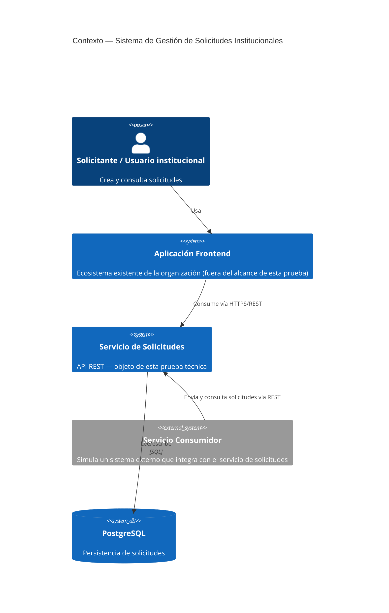
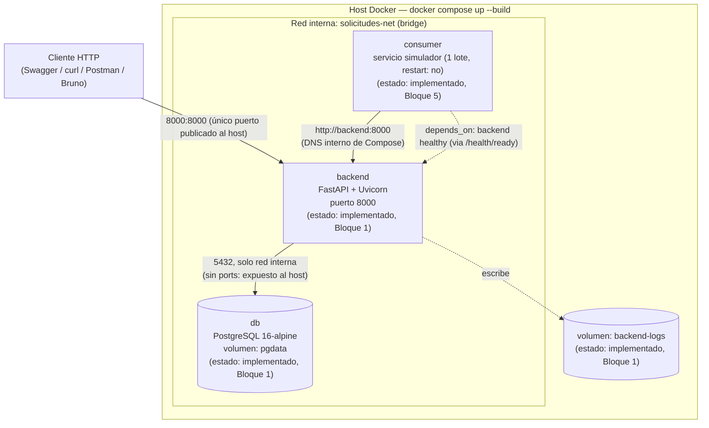
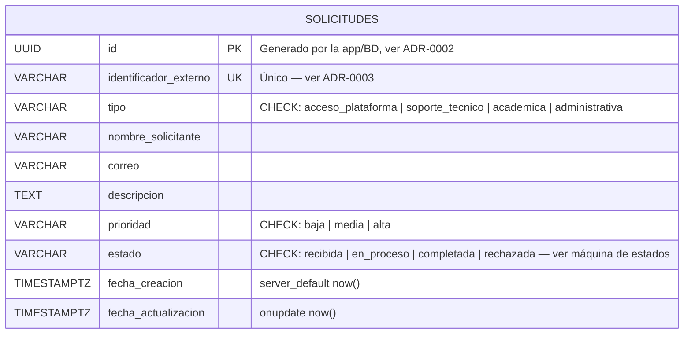
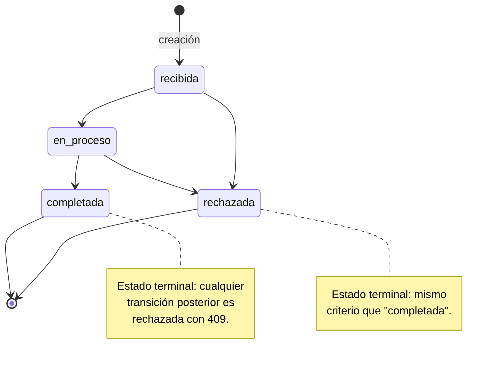
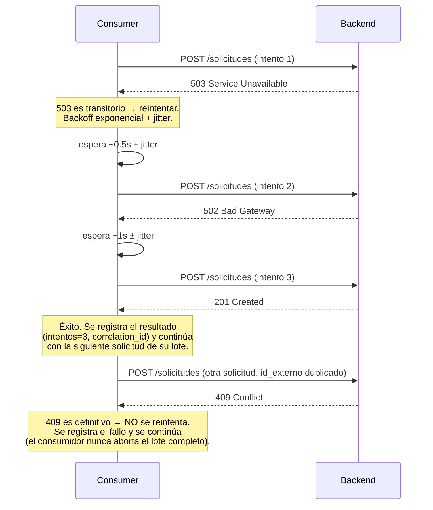

# Arquitectura del sistema

> Convención de esta prueba: se usa la notación **C4** (Contexto → Contenedores
> → Componentes) simplificada, más diagramas de secuencia para los dos flujos
> que concentran la mayor complejidad de negocio (concurrencia en la creación,
> y política de reintentos del consumidor). Cada diagrama indica qué parte ya
> está **implementada** y qué parte es **diseño planeado** para bloques
> siguientes, para que este documento sea honesto sobre el estado real del
> proyecto en cada momento (se actualiza a medida que avanza).

## 1. Diagrama de contexto (C4 – Nivel 1)

Quién usa el sistema y con qué otros sistemas interactúa, sin entrar en
tecnología todavía.



## 2. Diagrama de contenedores (C4 – Nivel 2) — topología Docker Compose



**Nota de diseño verificada empíricamente (Bloque 1):** `db` no publica el
puerto 5432 al host — solo es alcanzable desde `backend` dentro de la red
`solicitudes-net`. Es la misma restricción que exige la sección de AWS
("PostgreSQL deberá permanecer en una red privada"), aplicada aquí ya en el
entorno local para que el hábito y el diseño sean uno solo, no dos mundos
distintos.

## 3. Modelo de datos (diagrama entidad-relación) — implementado (Bloque 2)



Índices implementados (verificados con `\d solicitudes` en PostgreSQL):
`UNIQUE(identificador_externo)` (integridad + soporte de `ON CONFLICT`);
compuesto `(estado, tipo, prioridad)` (filtro combinado del listado);
`(fecha_creacion DESC)` (orden por defecto).

### Máquina de estados de `estado` (implementada y aplicada — Bloque 3)



## 4. Diagrama de secuencia — creación concurrente (ADR-0003)

Dos peticiones simultáneas con el **mismo** `identificador_externo`. Este es
el flujo que la prueba pide manejar explícitamente ("solicitudes concurrentes
con el mismo identificador").

```mermaid
sequenceDiagram
    participant C1 as Cliente A
    participant C2 as Cliente B
    participant API as Backend (FastAPI)
    participant DB as PostgreSQL

    par Peticiones simultáneas
        C1->>API: POST /solicitudes (id_externo=X)
    and
        C2->>API: POST /solicitudes (id_externo=X)
    end

    API->>DB: INSERT ... ON CONFLICT (identificador_externo) DO NOTHING RETURNING *
    API->>DB: INSERT ... ON CONFLICT (identificador_externo) DO NOTHING RETURNING *

    Note over DB: El motor serializa las dos escrituras;<br/>solo una obtiene la fila (RETURNING no vacío).

    DB-->>API: fila creada (para la que ganó)
    DB-->>API: 0 filas (para la que perdió)

    API-->>C1: 201 Created (si ganó) / 409 Conflict (si perdió)
    API-->>C2: 201 Created (si ganó) / 409 Conflict (si perdió)

    Note over C1,C2: Exactamente una de las dos recibe 201.<br/>La otra recibe 409, nunca un 500.
```

## 5. Diagrama de secuencia — consumidor con reintentos (implementado, Bloque 5)



## 6. Estado de avance de este documento

| Sección | Estado |
|---|---|
| Contexto | Vigente desde Bloque 0 |
| Contenedores | Refleja el estado real verificado en Bloque 1 |
| Modelo de datos / ER | **Implementado y verificado** contra el esquema real de PostgreSQL (Bloque 2) |
| Máquina de estados | **Implementada y verificada** (Bloque 3): transición inválida devuelve 409 indicando los estados alcanzables |
| Secuencia de concurrencia | **Implementada y verificada empíricamente** (Bloque 2): 20 hilos simultáneos → 1 creación, 19 conflictos, 0 excepciones. Se convierte en test automatizado en Bloque 4 |
| Secuencia del consumidor | **Implementada y verificada**: 16 tests con `httpx.MockTransport` + ejecución real en `docker compose up` (10 éxitos, 1 conflicto 409, 0 fallos transitorios) |

Ver `docs/adr/` para la justificación detallada de cada decisión referenciada
aquí, y `docs/DECISIONES.md` para la bitácora narrativa del proceso completo.
