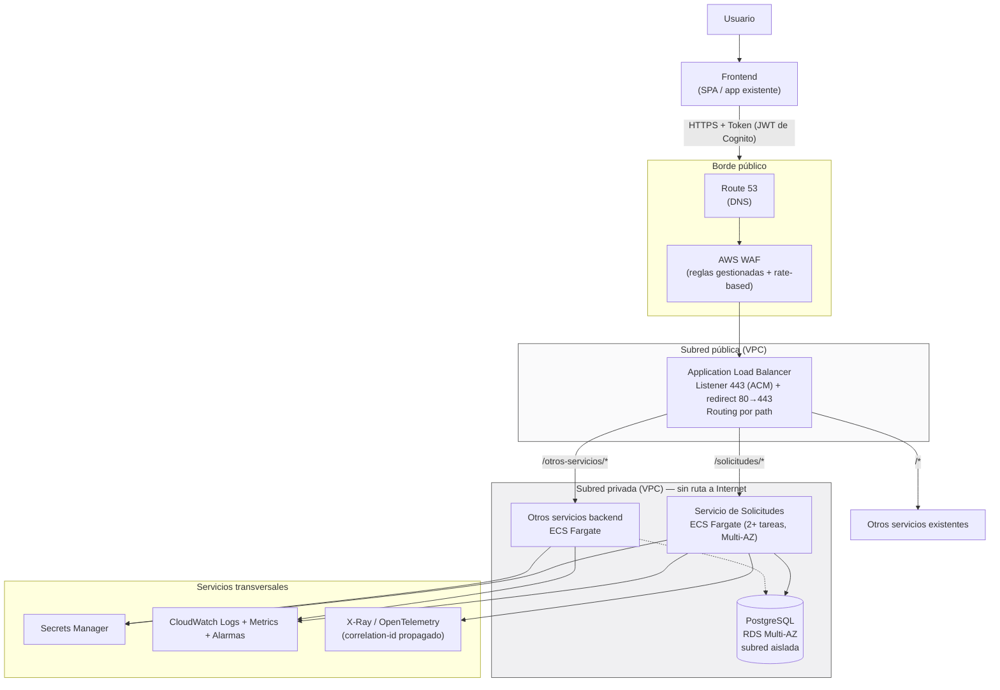

# Propuesta de despliegue e integración en AWS

> No se realiza despliegue real (fuera de alcance según el enunciado). Este
> documento describe cómo se llevaría este servicio a un ecosistema AWS que ya
> tiene un frontend y varios servicios backend, con la justificación de cada
> componente — el enunciado indica explícitamente que "no será suficiente
> mencionar nombres de servicios de AWS".

## 1. Arquitectura propuesta (visión general)



## 2. Servicios de AWS seleccionados y función de cada uno

| Servicio | Función concreta | Por qué resuelve el problema (no solo "qué es") |
|---|---|---|
| **Route 53** | DNS del dominio público (`api.empresa.com`) | Permite failover de DNS y health checks activos si se necesitara multi-región a futuro; es el punto donde se ancla el certificado del dominio. |
| **AWS WAF** (asociado al ALB) | Filtra tráfico malicioso antes del ALB: reglas gestionadas (OWASP Top 10, SQLi, XSS) + regla *rate-based* por IP | Resuelve "protección frente a tráfico malicioso" del enunciado sin escribir lógica de filtrado en cada servicio — el control vive una sola vez, en el borde. |
| **Application Load Balancer (ALB)** | Único punto de entrada HTTP(S) público; *routing* por path hacia los distintos servicios backend | Se elige **ALB sobre API Gateway** para el tráfico del frontend propio: *path-based routing* (`/solicitudes/*`, `/otros/*`) resuelve el enrutamiento multi-servicio con menor latencia y costo que API Gateway + VPC Link, que añade un salto extra sin aportar valor cuando el único consumidor es el frontend interno. **API Gateway se reserva** para el día en que se necesite exponer la API a terceros con planes de uso, *API keys* o *throttling* por cliente — no se implementa ahora para no añadir un componente sin función. |
| **ACM (Certificate Manager)** | Emite y renueva automáticamente el certificado TLS del ALB | Cumple "acceso público mediante HTTPS" sin gestión manual de certificados ni rotación manual. |
| **ECS Fargate** | Ejecuta los contenedores del backend (y del resto de servicios) sin gestionar servidores EC2 | Cada *task* corre en subred **privada**, sin IP pública — cumple la restricción "el backend no podrá exponerse directamente a Internet" por diseño de red, no por configuración de aplicación. |
| **ECR (Elastic Container Registry)** | Almacena las imágenes Docker del backend y del consumidor, con *scan on push* | El *pipeline* de CI construye y publica la imagen con un tag inmutable (nunca `latest`) por cada commit a `main`; ECS referencia ese tag exacto en su *task definition*. |
| **RDS PostgreSQL (Multi-AZ)** | Base de datos gestionada, en subred **aislada** sin ruta a Internet (sin *NAT*, sin *Internet Gateway*) | Cumple "PostgreSQL deberá permanecer en una red privada"; Multi-AZ da failover automático de la réplica síncrona sin intervención manual. |
| **VPC Endpoints** (Interface: ECR, Secrets Manager, CloudWatch Logs; Gateway: S3) | Permiten que las tareas de Fargate en subred privada hablen con esos servicios de AWS sin salir a Internet | Evita depender de un NAT Gateway para tráfico que en realidad es tráfico *dentro* de AWS, reduciendo coste y superficie de exposición. |
| **Secrets Manager** | Almacena credenciales de RDS y cualquier *secret* de aplicación; rotación automática | Las credenciales se inyectan en la *task definition* como referencia al ARN del secreto — **nunca** como variable de entorno en texto plano ni horneadas en la imagen. Cumple "las credenciales no podrán almacenarse en el código ni en las imágenes Docker". |
| **IAM (roles por tarea, *task role*)** | Cada servicio tiene su propio rol con permisos mínimos (p. ej. `secretsmanager:GetSecretValue` solo sobre su ARN específico) | Aplica mínimo privilegio real, no un rol compartido con `*`; un servicio comprometido no hereda permisos de otros. |
| **Cognito** (o el IdP ya existente de la organización) | Emite JWT a los usuarios autenticados desde el frontend | El ALB puede validar el token en el *listener* (*authenticate-oidc*) como primera barrera, pero **cada servicio backend valida el token de nuevo** — la autenticación en el borde no protege el tráfico este-oeste dentro de la VPC si un servicio interno es comprometido. |
| **CloudWatch Logs + Container Insights** | Recolecta el log JSON estructurado que ya emite la aplicación (mismo formato definido en `docs/ARQUITECTURA.md`) | Centraliza logs de todos los servicios; el `correlation_id` generado por el consumidor y propagado por el backend permite reconstruir el viaje completo de una solicitud a través de `CloudWatch Logs Insights`. |
| **CloudWatch Alarms + SNS** | Alertas sobre tasa de error 5xx del *target group*, latencia p95, CPU/memoria de las tareas | Detecta degradación antes de que la reporten los usuarios; dispara rollback automático (ver sección 6). |
| **X-Ray / OpenTelemetry** | Trazabilidad distribuida entre ALB → servicio → RDS | Complementa el `correlation_id` de aplicación con trazas de infraestructura (latencia por segmento de la petición). |
| **CodePipeline + CodeBuild + CodeDeploy** | CI/CD: build de imagen → push a ECR → despliegue *blue/green* en ECS | Automatiza el ciclo completo con *rollback* automático si una alarma de CloudWatch se dispara durante el despliegue. |

## 3. Configuración del punto de entrada

- **Listener 443** en el ALB con certificado ACM; **listener 80** solo redirige (301) a 443 — nunca se sirve tráfico HTTP plano.
- **Target group** por servicio, con *health check* apuntando a `GET /health/ready` de cada uno (no `/health`): así el ALB saca de rotación una tarea que perdió la conexión a RDS sin matarla — se le da la oportunidad de recuperarse sin interrumpir el ciclo de vida del contenedor.
- **Reglas de enrutamiento** basadas en *path pattern*: `/solicitudes/*` → target group del servicio de solicitudes; el resto de patrones apunta a los servicios backend ya existentes en el ecosistema, permitiendo que este servicio se integre sin reconfigurar los demás.

## 4. Segmentación de red y reglas de acceso (mínimo privilegio por capas)

Los *security groups* se encadenan **por referencia**, nunca por rango de IP (CIDR) abierto internamente:

```
SG-ALB   : permite 443/80 desde 0.0.0.0/0 (único punto abierto a Internet)
SG-ECS   : permite 8000 (o el puerto interno) SOLO desde SG-ALB
SG-RDS   : permite 5432 SOLO desde SG-ECS
```

Esto hace que, aunque alguien obtuviera una IP dentro de la VPC, no pueda
alcanzar RDS directamente sin pasar por un servicio que ya tiene el SG
correcto — la segmentación es estructural, no una regla que dependa de
recordarla.

- **Subred pública:** solo el ALB (y NAT Gateway, si se decide usar en vez de VPC Endpoints para tráfico saliente ocasional).
- **Subred privada:** ECS Fargate (servicios backend), sin IP pública asignada.
- **Subred aislada:** RDS, sin ruta a Internet Gateway ni NAT.

## 5. Autenticación y autorización

- **Usuario → Frontend → Backend:** JWT emitido por Cognito (o el IdP corporativo existente); el frontend lo adjunta en `Authorization: Bearer`. Cada servicio backend valida firma, expiración y *claims* (rol/alcance) — no delega esa responsabilidad únicamente al ALB.
- **Servicio → Servicio:** para llamadas internas (p. ej. si el servicio de solicitudes necesitara consultar a otro backend del ecosistema), se usa IAM SigV4 (si ambos están en AWS y pueden asumir roles) o credenciales de cliente OAuth2 (*client_credentials*) con audiencia específica por servicio — nunca un token compartido entre servicios.
- **CORS:** configurado en el propio servicio (lista explícita de orígenes permitidos del frontend, no `*`), coherente con exponer la API solo detrás de HTTPS.
- **Rate limiting:** regla *rate-based* en WAF (por IP/ventana de tiempo) como primera línea; límites adicionales por *API key* si en el futuro se habilita API Gateway para terceros.

## 6. Escalabilidad, despliegue y reversión

- **Escalado:** *target tracking* de Application Auto Scaling sobre CPU (~60-70%) y `RequestCountPerTarget` del ALB — agrega/quita tareas de Fargate automáticamente.
- **Despliegue:** CodeDeploy en modo *blue/green* sobre ECS: se levanta el conjunto de tareas nuevo, el ALB desvía tráfico gradualmente (o de forma completa tras validar *health checks*), y el conjunto anterior se mantiene activo un período de gracia.
- **Reversión:** si una alarma de CloudWatch (tasa de 5xx, latencia) se dispara durante o después del despliegue, CodeDeploy revierte automáticamente el *target group* al conjunto de tareas anterior — sin intervención manual y sin tiempo de inactividad perceptible.

## 7. Extensibilidad (nuevos servicios)

Añadir un nuevo servicio backend al ecosistema implica: una nueva *task
definition* + *service* en ECS (en la misma subred privada), un nuevo *target
group*, y una nueva regla de *path pattern* en el ALB existente — no requiere
tocar el punto de entrada público, el WAF, ni los servicios ya desplegados.
Esa es precisamente la propiedad que exige el enunciado ("la arquitectura
deberá permitir incorporar nuevos servicios").

---

*Diagrama de flujo mínimo exigido por el enunciado — ver equivalente Mermaid
en la sección 1; forma textual de referencia:*

```
Usuario → Frontend → HTTPS+Token → DNS/WAF → ALB
    → { Servicio de Solicitudes | Otros servicios backend }
        → PostgreSQL privado (RDS Multi-AZ)
    Servicios backend → Gestión de secretos (Secrets Manager)
    Servicios backend → Logs, métricas y alertas (CloudWatch)
    Servicios backend → Trazabilidad (X-Ray / correlation-id)
```
