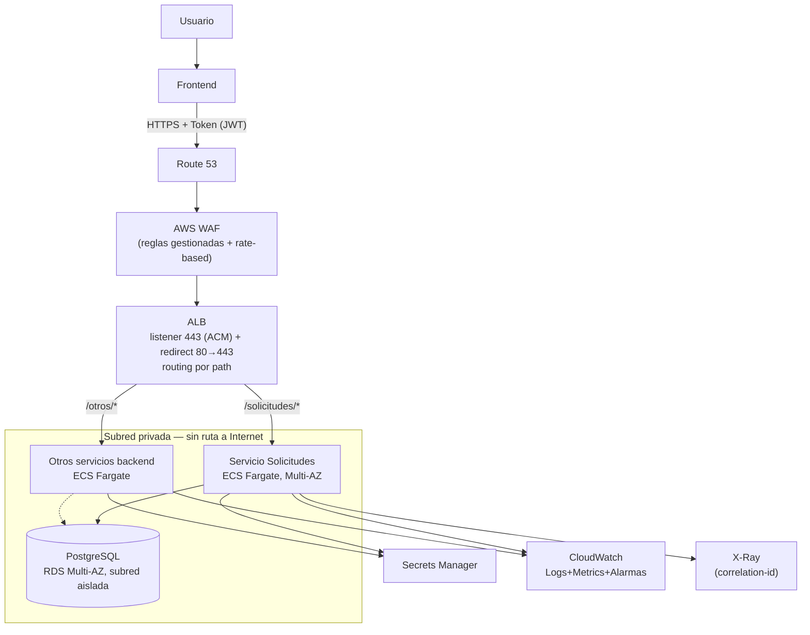
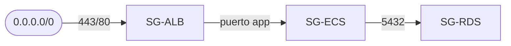
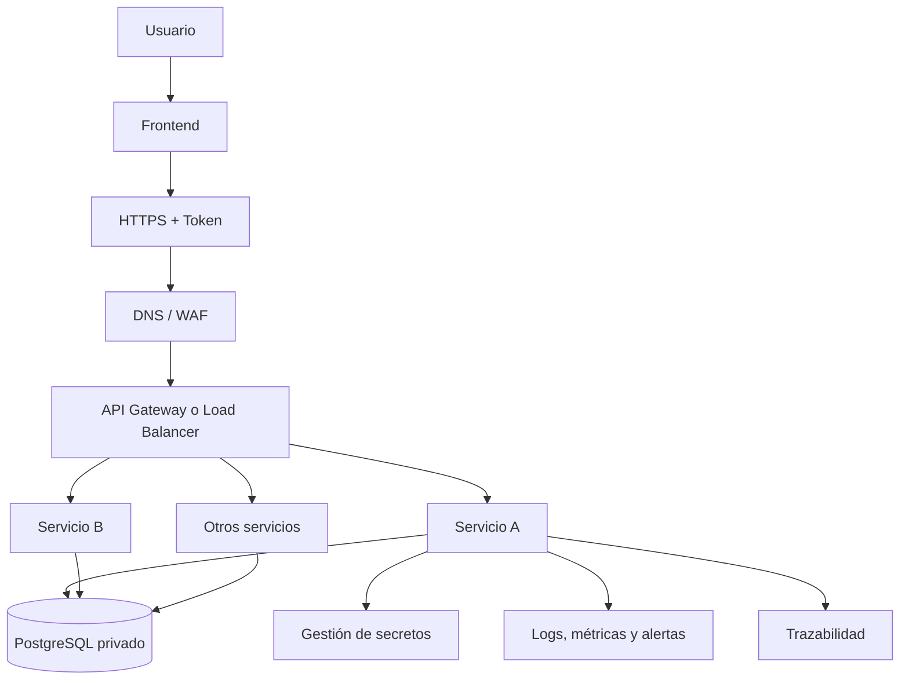

# Propuesta de despliegue e integración en AWS

> Sin despliegue real (fuera de alcance). Se describe cómo este servicio se
> integraría en un ecosistema AWS con un frontend y varios backends ya
> existentes, justificando función y configuración de cada componente — no
> solo nombrándolos.

## 1. Arquitectura

## 2. Servicios y función de cada uno

| Servicio | Función | Cómo resuelve el problema |
|---|---|---|
| Route 53 + WAF + ACM | DNS público, filtrado de tráfico malicioso, certificado TLS | WAF con reglas gestionadas (OWASP) + *rate-based* por IP antes del ALB; ACM renueva el certificado sin gestión manual. El control vive una sola vez, en el borde |
| ALB | Único punto de entrada; *routing* por path (`/solicitudes/*`, `/otros/*`) | Se elige sobre API Gateway para el tráfico del frontend propio: menor latencia/costo que API GW + VPC Link. API Gateway se reserva para exponer a terceros con *API keys*/*throttling* — no se añade ahora sin función real |
| ECS Fargate + ECR | Ejecuta los contenedores en subred **privada**; ECR almacena las imágenes con *scan on push* | Sin IP pública: el backend nunca es alcanzable directamente desde Internet. CI publica con tag inmutable por commit; ECS referencia ese tag exacto |
| RDS PostgreSQL Multi-AZ + VPC Endpoints | BD en subred **aislada** (sin NAT/IGW); endpoints privados hacia ECR/Secrets Manager/CloudWatch | Cumple "PostgreSQL en red privada"; failover automático sin intervención; el tráfico hacia otros servicios de AWS no sale a Internet |
| Secrets Manager + IAM (rol por tarea) | Credenciales de RDS y secretos de app, con rotación; permisos mínimos por servicio | Se referencian por ARN en la *task definition* (nunca texto plano ni horneado en la imagen); p. ej. `secretsmanager:GetSecretValue` solo sobre su ARN — mínimo privilegio real |
| Cognito / IdP existente | Emite JWT al frontend | El ALB puede validar en el *listener*, pero **cada servicio valida de nuevo** — el borde no protege el tráfico interno |
| CloudWatch + X-Ray | Centraliza el log JSON ya emitido por la app; traza distribuida ALB→servicio→RDS; alarmas sobre 5xx/latencia/CPU | El `correlation_id` (nace en el consumidor, se propaga al backend) permite reconstruir una petición completa en Logs Insights; las alarmas disparan el rollback de §5 |
| CodePipeline/Build/Deploy | CI/CD: build → ECR → despliegue *blue/green* | Rollback automático si una alarma se dispara durante el despliegue |

## 3. Punto de entrada y enrutamiento

- Listener **443** con certificado ACM; **80** solo redirige (301) a 443.
- *Target group* por servicio con health check en **`/health/ready`** (no `/health`): el ALB saca de rotación una tarea que perdió la BD sin matarla — misma distinción liveness/readiness del backend (ver `docs/adr/0010`).
- Reglas por *path pattern*: `/solicitudes/*` → este servicio; el resto apunta a los servicios ya existentes, sin reconfigurarlos.

## 4. Segmentación y acceso (mínimo privilegio en cadena)

Security groups referenciados entre sí, nunca por CIDR abierto internamente:

Aunque algo obtuviera una IP dentro de la VPC, no alcanza RDS sin pasar por un servicio con el SG correcto: la segmentación es estructural. Subredes: **pública** (solo ALB), **privada** (ECS, sin IP pública), **aislada** (RDS, sin ruta a Internet).

## 5. Autenticación, CORS/rate-limit, y despliegue

- **Usuario→Backend:** JWT de Cognito/IdP; el frontend lo adjunta en `Authorization`. Cada servicio valida firma/expiración/claims — no delega solo al ALB.
- **Servicio→Servicio:** IAM SigV4 o *client_credentials* con audiencia por servicio; nunca un token compartido.
- **CORS:** se configura en **cada servicio backend** (`CORSMiddleware` de FastAPI ya expuesto por el framework), no en el ALB —que no interpreta CORS, solo enruta TCP/HTTP— ni en el WAF. `allow_origins` lista los dominios exactos del frontend (nunca `*`), tomados de una variable de entorno inyectada por servicio para poder diferir entre `staging`/`prod` sin rebuild. **Rate limiting:** regla *rate-based* en WAF (límite por IP/ventana, antes de llegar al ALB); *API keys* con *usage plans* si se habilita API Gateway para terceros.
- **Escalado:** *target tracking* sobre CPU y `RequestCountPerTarget`.
- **Despliegue:** CodeDeploy *blue/green* sobre ECS — tráfico se desvía tras validar health checks del nuevo conjunto.
- **Reversión:** una alarma de CloudWatch (5xx, latencia) durante el despliegue dispara rollback automático al conjunto anterior, sin intervención manual ni downtime perceptible.

## 6. Extensibilidad

Agregar un servicio nuevo = una *task definition* + *target group* + una regla de *path pattern* en el ALB ya existente. No toca el punto de entrada público, el WAF ni los servicios ya desplegados — la propiedad que exige el enunciado.

---

## 7. Flujograma mínimo exigido

