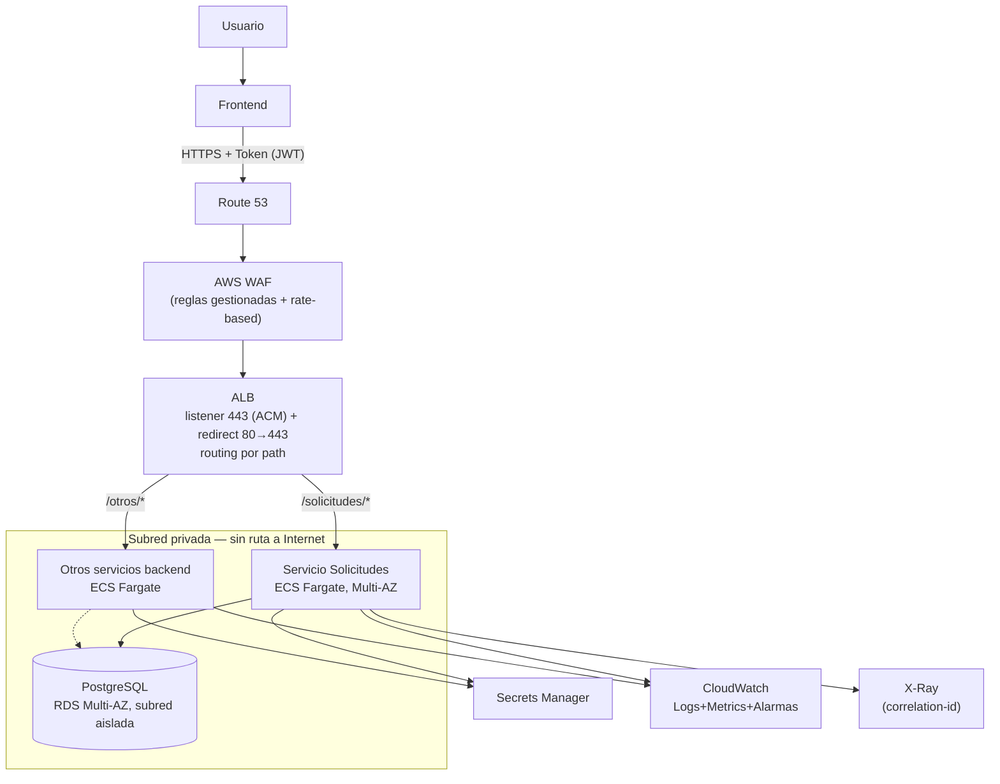

# Propuesta de despliegue e integración en AWS

> Sin despliegue real (fuera de alcance). Se describe cómo este servicio se
> integraría en un ecosistema AWS con un frontend y varios backends ya
> existentes, justificando función y configuración de cada componente — no
> solo nombrándolos.

## 1. Arquitectura



## 2. Servicios y función de cada uno

| Servicio | Función | Cómo resuelve el problema |
|---|---|---|
| Route 53 | DNS del dominio público | Punto de anclaje del certificado y de failover si se escala a multi-región |
| AWS WAF | Filtra tráfico malicioso antes del ALB | Reglas gestionadas (OWASP) + *rate-based* por IP; el control vive una vez, en el borde |
| ALB | Único punto de entrada; *routing* por path (`/solicitudes/*`, `/otros/*`) | Se elige sobre API Gateway para tráfico del frontend propio: menor latencia/costo que API GW + VPC Link. API Gateway se reserva para exponer a terceros con *API keys*/*throttling*, no se implementa ahora sin función real |
| ACM | Certificado TLS del ALB, renovación automática | Cumple HTTPS obligatorio sin gestión manual |
| ECS Fargate | Ejecuta los contenedores, sin gestionar EC2 | Subred **privada**, sin IP pública: el backend nunca es alcanzable directamente desde Internet |
| ECR | Almacena las imágenes (backend, consumer), *scan on push* | CI construye y publica con tag inmutable por commit; ECS referencia ese tag exacto |
| RDS PostgreSQL Multi-AZ | BD gestionada en subred **aislada**, sin NAT/IGW | Cumple "PostgreSQL en red privada"; failover automático sin intervención |
| VPC Endpoints (ECR, Secrets Manager, CloudWatch Logs) | Acceso a servicios AWS sin salir a Internet | Evita NAT Gateway para tráfico que es interno a AWS |
| Secrets Manager | Credenciales de RDS y secretos de app, con rotación | Se referencia por ARN en la *task definition*; nunca texto plano ni horneado en la imagen |
| IAM (rol por tarea) | Permisos mínimos por servicio | P. ej. `secretsmanager:GetSecretValue` solo sobre su ARN — mínimo privilegio real |
| Cognito / IdP existente | Emite JWT al frontend | El ALB puede validar en el *listener*, pero **cada servicio valida de nuevo** — el borde no protege el tráfico interno |
| CloudWatch (+Container Insights) | Centraliza el log JSON ya emitido por la app | El `correlation_id` (nace en el consumidor, ver Bloque 5) permite reconstruir una petición completa en Logs Insights |
| CloudWatch Alarms + SNS | Alerta sobre tasa de 5xx, latencia, CPU/memoria | Dispara rollback automático (§5) |
| X-Ray / OpenTelemetry | Traza distribuida ALB→servicio→RDS | Complementa el `correlation_id` con latencia por segmento |
| CodePipeline/Build/Deploy | CI/CD build→ECR→despliegue *blue/green* | Rollback automático si una alarma se dispara durante el despliegue |

## 3. Punto de entrada y enrutamiento

- Listener **443** con certificado ACM; **80** solo redirige (301) a 443.
- *Target group* por servicio con health check en **`/health/ready`** (no `/health`): el ALB saca de rotación una tarea que perdió la BD sin matarla — misma distinción liveness/readiness del backend (ver `docs/adr/0010`).
- Reglas por *path pattern*: `/solicitudes/*` → este servicio; el resto apunta a los servicios ya existentes, sin reconfigurarlos.

## 4. Segmentación y acceso (mínimo privilegio en cadena)

Security groups referenciados entre sí, nunca por CIDR abierto internamente:

```
SG-ALB : 443/80 desde 0.0.0.0/0 (único punto abierto)
SG-ECS : puerto app SOLO desde SG-ALB
SG-RDS : 5432 SOLO desde SG-ECS
```

Aunque algo obtuviera una IP dentro de la VPC, no alcanza RDS sin pasar por un servicio con el SG correcto: la segmentación es estructural. Subredes: **pública** (solo ALB), **privada** (ECS, sin IP pública), **aislada** (RDS, sin ruta a Internet).

## 5. Autenticación, CORS/rate-limit, y despliegue

- **Usuario→Backend:** JWT de Cognito/IdP; el frontend lo adjunta en `Authorization`. Cada servicio valida firma/expiración/claims — no delega solo al ALB.
- **Servicio→Servicio:** IAM SigV4 o *client_credentials* con audiencia por servicio; nunca un token compartido.
- **CORS:** orígenes explícitos del frontend, nunca `*`. **Rate limiting:** regla *rate-based* en WAF; *API keys* si se habilita API Gateway a terceros.
- **Escalado:** *target tracking* sobre CPU y `RequestCountPerTarget`.
- **Despliegue:** CodeDeploy *blue/green* sobre ECS — tráfico se desvía tras validar health checks del nuevo conjunto.
- **Reversión:** una alarma de CloudWatch (5xx, latencia) durante el despliegue dispara rollback automático al conjunto anterior, sin intervención manual ni downtime perceptible.

## 6. Extensibilidad

Agregar un servicio nuevo = una *task definition* + *target group* + una regla de *path pattern* en el ALB ya existente. No toca el punto de entrada público, el WAF ni los servicios ya desplegados — la propiedad que exige el enunciado.

---

*Flujograma mínimo exigido, forma textual:* Usuario → Frontend → HTTPS+Token → DNS/WAF → ALB → {Servicio de Solicitudes | Otros backends} → PostgreSQL privado (RDS Multi-AZ); Servicios backend → Secrets Manager / CloudWatch / X-Ray.
